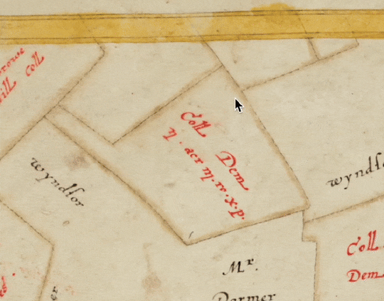

# Annotorious Magnetic Outline Tools

An Annotorious plugin that adds **computer-vision powered drawing tools** for semi-automatic annotation. 



## Tools

### 1. Intelligent Scissors

A Photoshop-style "magnetic lasso" for tracing object outlines. Automatically follows edges as you move the cursor, making it easy to outline complex shapes with minimal clicking.

**How to use:**
1. Click to place a starting point on the object’s edge (_the cursor will briefly change to a wait spinner_).
2. Move the cursor along the outline — the tool will automatically trace the edge.
3. Click to lock in intermediate points if needed for tricky areas.
4. Double-click or click back on the first point to complete the shape. 

> **Note:** You cannot zoom or pan the image while drawing with this tool.

### 2. Magnetic Cursor

Snaps the mouse cursor to corner points of nearby objects in the image – ideal for quickly marking precise points.

**How to use:**
1. Move the crosshair near the edge or corner of an object.
2. The cursor will "snap" to detected points for accurate placement.
3. Click to place points.
4. Double-click or click back on the first point to complete the shape. 

> **Note:** After zooming or panning the image, the cursor will be briefly unavailable while keypoints are re-computed for the new view.

## Installation

```sh
npm install @annotorious/plugin-magnetic-outline
```

> **Important:** 
> This plugin currently supports **only** `@annotorious/openseadragon`. Support for plain images (JPEG, PNG,...) is not yet available. [Join the discussion](https://github.com/orgs/annotorious/discussions) if you're interested in these integrations.

## Usage

```js
import OpenSeadragon from 'openseadragon';
import { createOSDAnnotator } from '@annotorious/openseadragon';
import { mountPlugin } from '@annotorious/plugin-magnetic-outline';

import '@annotorious/openseadragon/annotorious-openseadragon.css';

const viewer = OpenSeadragon({
  /** OSD init options **/  
});

const anno = createOSDAnnotator(viewer, {
  /** Annotorious init options **/
});

// Mounts the plugin and registers both tools
mountPlugin(anno);

// Set the active tool
anno.setDrawingTool('magnetic-cursor'); // or 'intelligent-scissors'
```